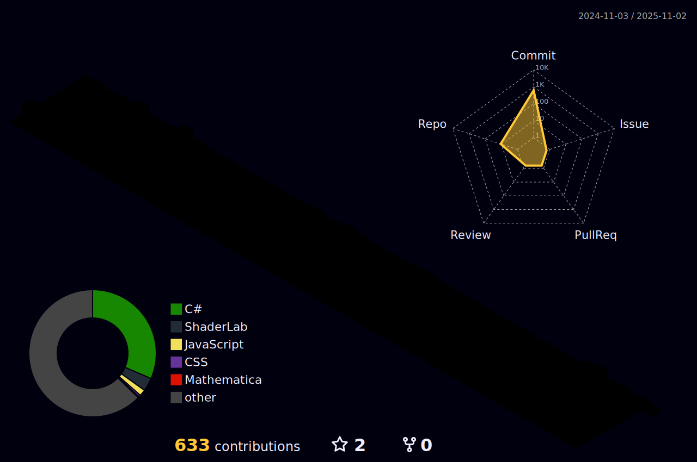

    

## High School
|Web|Information security|cloud computing|
|------|---|---|
|IT Network(2022-05-02 ~ 2023-12-14)|IT Network(2022-05-02 ~ 2023-12-14)|AWS Study(2022-05-13 ~ 2022-07-20)|
|Advanced Web Development Course(2023-01-10 ~ 2023-02-01)|Cyber ​​Guardians(2022-09-05 ~ 2022-12-01)|AWS (Amazon web service network construction and setup)(2022-11-04 ~ 2022-11-26)|
|Employment customized class(2023-05-23 ~ 2023-06-12)|Cyber ​​Guardians conference(2022-11-09)|Skill competition cloud computing event preparation class(2022-11-26 ~ 2023-01-06)|
|||Final preparation process for the 2023 Skills Competition(2023-03-20 ~ 2023-03-31)|
|||Skills Competition 2023(2023-04-03 ~ 2023-04-07)|

## College
|VR / Game|
|------|
|Desina Game production club(2024-03-04 ~ 20OO-OO-OO)|
|Quaternion programming club(2024-03-13 ~ 20OO-OO-OO)|
|2024 Game Project Team 7 (2024-04-03 ~ 2024-06-21)|
|2024 Desina Game Project Team A (2024-04-08 ~ 2024-05-06)|
|Do It Do It(Game production) Study(2024-04-04 ~ 2024-05-30)|

# My Skills
|C Series|Front Eed|Back End|Design|Linux|Cloud Computing|Game Engine|
|:---:|:---:|:---:|:---:|:---:|:---:|:---:|
| |||||||
| |||| |
| |||||

